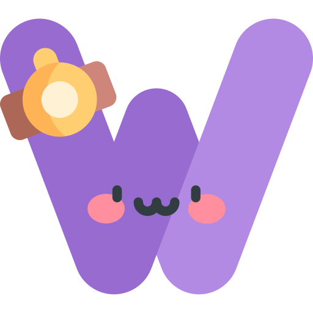

<!-- PROJECT LOGO -->
<h1 align="center">Word Scramble</h1>

  

# Présentation
Word Scramble est un jeu amusant où les joueurs doivent déchiffrer un mot mélangé pour trouver le mot original.

# Fonctionnalités
- Interface utilisateur intuitive : Jouez facilement sans distractions.
- Chronomètre : Testez votre rapidité pour déchiffrer le mot avant la fin du temps imparti.
- Niveaux de difficulté : Choisissez parmi plusieurs niveaux de difficulté pour augmenter le défi.

# Comment démarrer ?
- Cloner le répertoire
- Ouvrez index.html dans votre navigateur préféré.
- Testez !

# Comment jouer ?
- Sélectionnez un niveau de difficulté.
- Cliquez sur "Démarrer" pour commencer le jeu.
- Des lettres mélangées s'afficheront à l'écran.
- Essayez de former le mot correct en remettant les lettres dans le bon ordre.
- Entrez le mot et cliquez sur "Soumettre".
- Si votre réponse est correcte, vous passerez au mot suivant.

# Structure du projet
- index.html : Fichier principal de l'application.
- style.css : Style principal.
- script.js : Script principal du de l'application.

<!-- Réalisé -->
# Réalisé avec :
* HTML/CSS/JS
